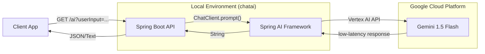

# 🌌 Chat AI: Exploring the Frontier of Gemini Flash

[](https://openjdk.org/projects/jdk/25/)
[](https://spring.io/projects/spring-boot)
[](https://spring.io/projects/spring-ai)
[](https://deepmind.google/technologies/gemini/flash/)

## 🚀 Mission
**Chat AI** is a high-performance demonstration project designed to stress-test and explore the capabilities of **Google's Gemini 1.5 Flash** model. Built with the latest cutting-edge Java ecosystem (JDK 25 and Spring Boot 4), this project serves as a reference architecture for integrating low-latency LLMs into enterprise-grade applications using **Spring AI**.

---

## 🏗️ System Architecture

The following diagram illustrates the streamlined flow from the user request to the intelligent response generation via Google Vertex AI.



---

## 🛠️ Tech Stack & Blueprint

- **Runtime**: [Java 25](https://openjdk.org/projects/jdk/25/) (Virtual Threads optimized)
- **Framework**: [Spring Boot 4.0.3](https://spring.io/projects/spring-boot)
- **AI Integration**: [Spring AI 2.0.0-M2](https://spring.io/projects/spring-ai)
- **Cloud Provider**: [Google Vertex AI](https://cloud.google.com/vertex-ai)
- **Model**: `gemini-1.5-flash` (Optimized for speed and efficiency)
- **Build Tool**: Maven

---

## ⚙️ Configuration & Setup

To run this project, you need a Google Cloud Project with the Vertex AI API enabled.

1.  **GCP Setup**:
    *   Initialize your project and enable the Vertex AI API.
    *   Configure your `src/main/resources/application.properties`:
        ```properties
        spring.ai.vertex.ai.gemini.project-id=spring-ai-489215
        spring.ai.vertex.ai.gemini.location=us-east4
        ```

2.  **Authentication**:
    Ensure you have the Google Cloud SDK installed and authenticated:
    ```bash
    gcloud auth application-default login
    ```

---

## 🚦 API Endpoints

### 💬 Chat Generation
Generates a response from Gemini Flash based on user input.

*   **URL**: `/ai`
*   **Method**: `GET`
*   **Params**: `userInput` (String)
*   **Example**:
    ```bash
    curl "http://localhost:8081/ai?userInput=Explain+Quantum+Computing+in+one+sentence"
    ```

---

## 🛠️ Execution Guide

Build and run the application using the Maven wrapper:

```bash
# Clean and compile
./mvnw clean install

# Launch the Spring Boot application
./mvnw spring-boot:run
```

The server will be available at `http://localhost:8081`.

---

## ⚖️ License
This project is for experimental and testing purposes. All rights reserved.

---
*Created by an Architect for the next generation of AI Engineers.*
