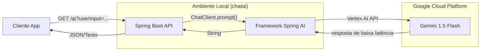

# 🌌 Chat AI: Explorando a Fronteira do Gemini Flash

[Read in English](README.md)


[](https://openjdk.org/projects/jdk/25/)
[](https://spring.io/projects/spring-boot)
[](https://spring.io/projects/spring-ai)
[](https://deepmind.google/technologies/gemini/flash/)

## 🚀 Missão
O **Chat AI** é um projeto de demonstração de alto desempenho projetado para testar o estresse e explorar as capacidades do modelo **Google Gemini 1.5 Flash**. Construído com o ecossistema Java mais recente (JDK 25 e Spring Boot 4), este projeto serve como uma arquitetura de referência para integrar LLMs de baixa latência em aplicações de nível empresarial usando o **Spring AI**.

---

## 🏗️ Arquitetura do Sistema

O diagrama a seguir ilustra o fluxo simplificado da requisição do usuário até a geração da resposta inteligente via Google Vertex AI.



---

## 🛠️ Tecnologias e Blueprint

- **Runtime**: [Java 25](https://openjdk.org/projects/jdk/25/) (Otimizado para Virtual Threads)
- **Framework**: [Spring Boot 4.0.3](https://spring.io/projects/spring-boot)
- **Integração de IA**: [Spring AI 2.0.0-M2](https://spring.io/projects/spring-ai)
- **Provedor de Nuvem**: [Google Vertex AI](https://cloud.google.com/vertex-ai)
- **Modelo**: `gemini-1.5-flash` (Otimizado para velocidade e eficiência)
- **Ferramenta de Build**: Maven

---

## ⚙️ Configuração e Instalação

Para rodar este projeto, você precisa de um Projeto no Google Cloud com a API Vertex AI habilitada.

1.  **Configuração do GCP**:
    *   Inicialize seu projeto e habilite a API Vertex AI.
    *   Configure seu arquivo `src/main/resources/application.properties`:
        ```properties
        spring.ai.vertex.ai.gemini.project-id=spring-ai-489215
        spring.ai.vertex.ai.gemini.location=us-east4
        ```

2.  **Autenticação**:
    Certifique-se de ter o Google Cloud SDK instalado e autenticado:
    ```bash
    gcloud auth application-default login
    ```

---

## 🚦 Endpoints da API

### 💬 Geração de Chat
Gera uma resposta do Gemini Flash baseada no input do usuário.

*   **URL**: `/ai`
*   **Método**: `GET`
*   **Parâmetros**: `userInput` (String)
*   **Exemplo**:
    ```bash
    curl "http://localhost:8081/ai?userInput=Explique+Computacao+Quantica+em+uma+frase"
    ```

---

## 🛠️ Guia de Execução

Compile e execute a aplicação usando o Maven wrapper:

```bash
# Limpar e compilar
./mvnw clean install

# Iniciar a aplicação Spring Boot
./mvnw spring-boot:run
```

O servidor estará disponível em `http://localhost:8081`.

---

## ⚖️ Licença
Este projeto é para fins experimentais e de teste. Todos os direitos reservados.

---
*Criado por um Arquiteto para a próxima geração de Engenheiros de IA.*
